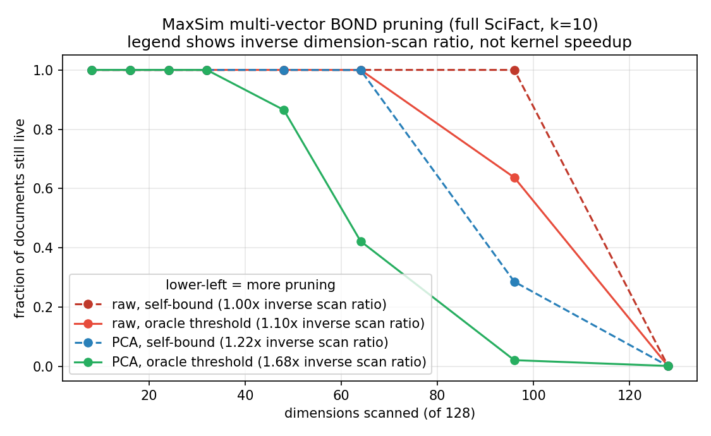
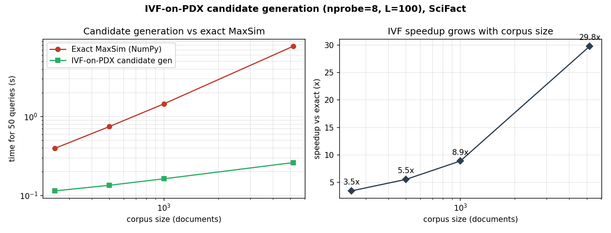
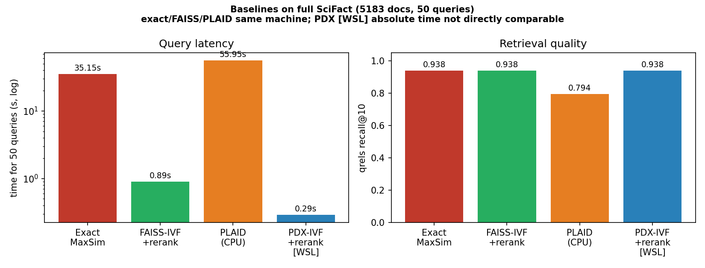
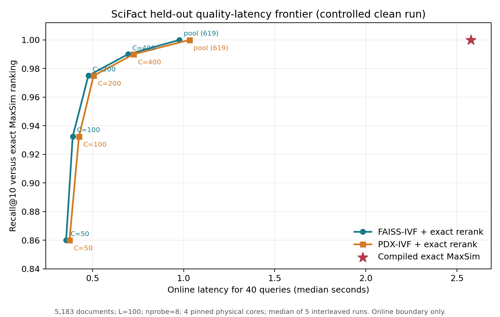
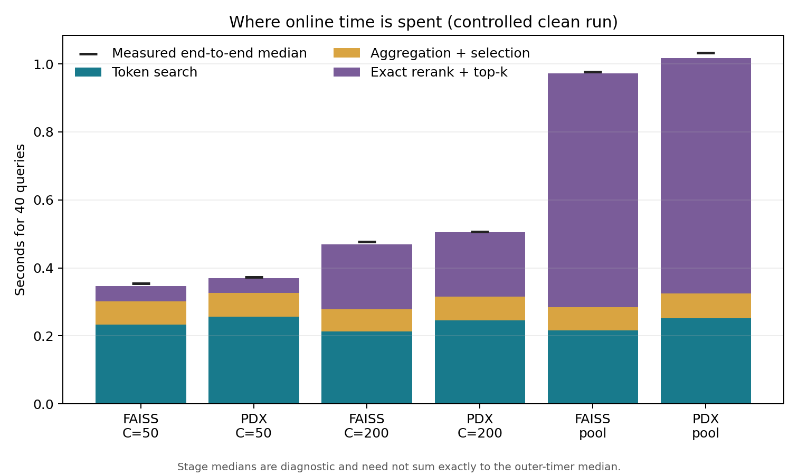
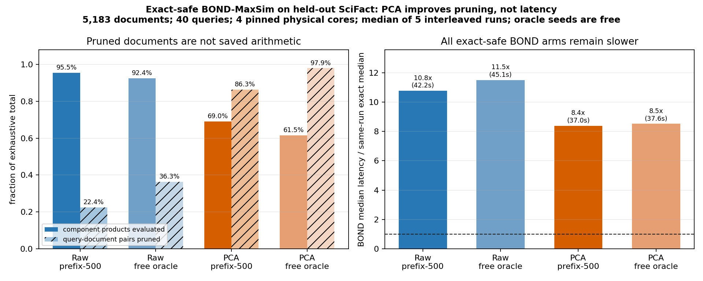
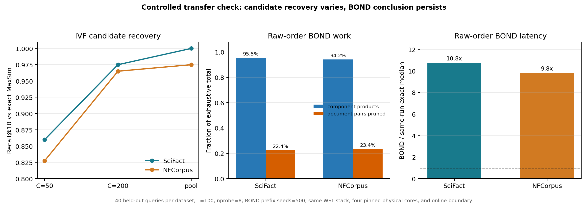
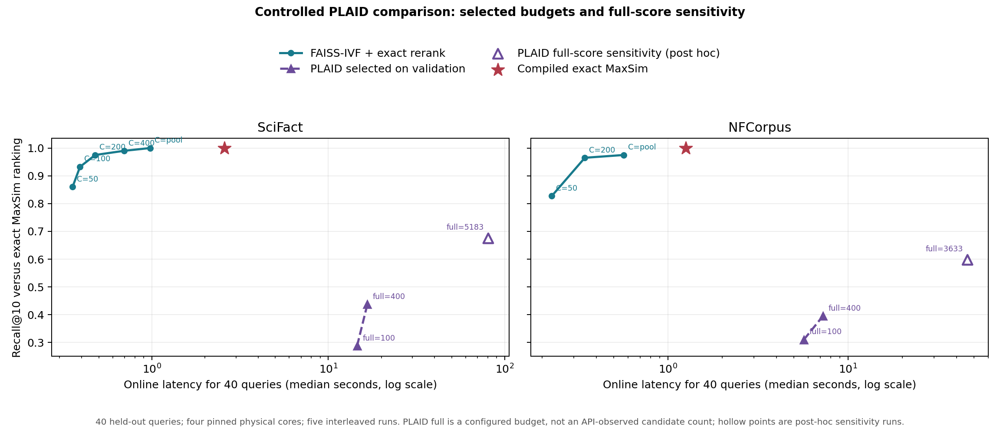
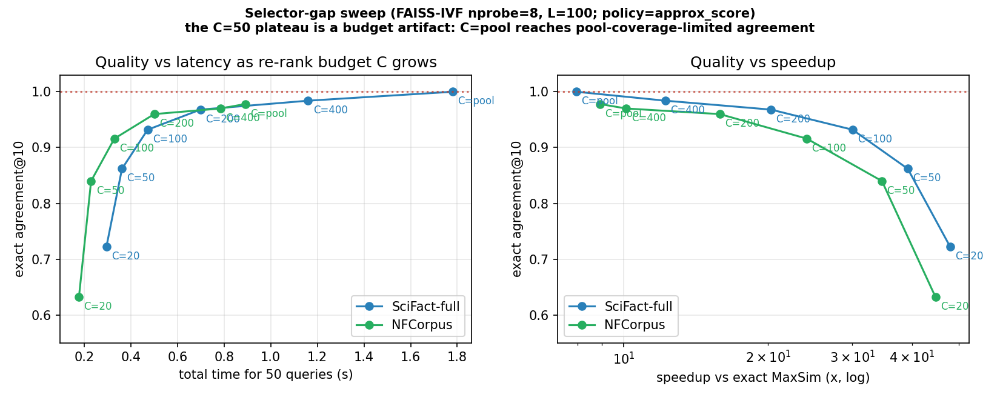

# Accelerating ColBERT Multi-Vector Search with PDX

Data Engineering project. **Primary goal:** test whether **PDX-BOND**
(branch-and-bound on vertically decomposed vectors, SIGMOD 2002) can speed up
**ColBERT-style multi-vector retrieval** using the PDX library, in an information
retrieval setting (BEIR benchmarks; CoRECT-scale evaluation as a follow-up).

ColBERT represents every document as a *variable-length set of token vectors*
and scores with **MaxSim**:

```text
score(query, document) = sum over query tokens q_i of  max over document tokens d_j of  <q_i, d_j>
```

This README is the project overview. The current repair plan, measurement rules,
and evidence audit are recorded in:

- [`docs/project_plan.md`](docs/project_plan.md)
- [`docs/project_report.md`](docs/project_report.md)
- [`docs/benchmark_protocol.md`](docs/benchmark_protocol.md)
- [`docs/audit_findings.md`](docs/audit_findings.md)
- [`docs/bond_kernel_design.md`](docs/bond_kernel_design.md)
- [`docs/final_results.md`](docs/final_results.md)
- [`docs/controlled_bond_results.md`](docs/controlled_bond_results.md) (pilot history)
- [`results/`](results/README.md)

---

## TL;DR - current evidence and re-evaluation

The controlled clean release provides direct evidence that BOND dimension
pruning is a poor fit for the tested 128-dimensional ColBERT embeddings.

1. **Flat PDX-BOND (`IndexPDXBONDFlat`) was slower than the historical NumPy
   reference.** This is an exploratory engineering result, not the final
   performance comparison.
2. **An independently authored exact-safe C++ BOND-MaxSim kernel preserves the
   exact top-10 but prunes too late.** On 40 held-out SciFact queries it evaluates
   95.47% of exhaustive component products and has 10.76 times the median
   latency of the compiled exact kernel.
3. **Batch-call and shared-scan prototypes did not solve the observed
   bottleneck.** Their historical timings are retained as diagnostics and will
   not be used as headline ratios.
4. **The raw-order BOND conclusion transfers to NFCorpus.** It evaluates 94.16%
   of component products and has 9.84 times the same-run exact median while
   preserving the exact top-10 set for all 40 held-out queries.

The comparison uses identical inputs, timing boundaries, thread budgets,
warm-ups, and repeated interleaved runs. All release artifacts point to clean
commit `0a11fda` and preserve raw samples and input hashes.

**Historical BOND mechanism figure (exploratory operation counts):**



---

### Secondary finding: promising candidate-generation architecture

While pursuing the BOND hypothesis we built a full ColBERT-on-PDX pipeline and
found that **IVF candidate generation followed by exact MaxSim reranking** can
recover strong document rankings with much less reranking work. The useful
mechanism is IVF cluster pruning rather than BOND dimension pruning.

- Candidate-pool coverage and exact-ranking recovery improve smoothly with the
  rerank budget `C`.
- FAISS-IVF shows the same architectural pattern, so this is not currently a
  PDX-specific contribution.
- The historical 30x/39x/32x speedup statements are withdrawn until all methods
  are rerun on one machine with matched work and complete online timing.

The following IVF figures are retained as exploratory history; their quality
axes remain useful, while their cross-method latency bars are not final results.




---

### Final controlled IVF comparison

A same-stack SciFact run compares a compiled exact kernel, FAISS-IVF,
and PDX-IVF under one complete online timing boundary. On 5,183 documents and
40 held-out queries:

| configuration | median (s) | exact recall@10 | reranked document ratio |
| --- | ---: | ---: | ---: |
| Compiled exact | 2.5774 | 1.0000 | 1.0000 |
| FAISS-IVF, C=200 | 0.4770 | 0.9750 | 0.0386 |
| PDX-IVF, C=200 | 0.5060 | 0.9750 | 0.0386 |
| FAISS-IVF, full candidate pool | 0.9773 | 1.0000 | 0.1195 |
| PDX-IVF, full candidate pool | 1.0322 | 1.0000 | 0.1195 |

The PDX and FAISS quality curves are identical. Their latency ordering changes
across budgets and datasets, so there is no consistent PDX-specific advantage.
See [`docs/final_results.md`](docs/final_results.md) and the raw JSON under
`results/final/`.




---

### Compiled exact-safe BOND result

The primary held-out decision run uses 5,183 documents, 40 queries, four pinned
CPUs, and five interleaved measured repetitions:

| arm | median (s) | p95 (s) | exact top-10 | component-product ratio |
| --- | ---: | ---: | ---: | ---: |
| Compiled exhaustive MaxSim (float64 accumulation) | 3.9208 | 4.1007 | 40/40 | 1.0000 |
| Exact-safe BOND-MaxSim, seed=500 | 42.1947 | 43.3968 | 40/40 | 0.9547 |

BOND prunes 22.4% of query-document pairs, but every prune occurs at dimension
96 of 128. The 4.53% arithmetic reduction does not offset bound maintenance,
branching, and less regular memory access. See
[`docs/final_results.md`](docs/final_results.md).

A free exact-top-10 oracle seed policy still evaluates 92.43% of products. PCA
rotation improves the component-product ratio to 0.6902 with prefix seeds and
0.6153 with free oracle seeds, but both PCA arms retain 8.38--8.51 times the
same-run exhaustive median latency. This demonstrates why inverse operation
count cannot be reported as speedup.



---

### Controlled transfer check

The same configuration was also run on 3,633 NFCorpus documents, 864,703
document token vectors, and 40 held-out queries. Candidate quality is more
difficult than on SciFact: reranking the complete retrieved pool reaches 0.975
exact recall@10 rather than 1.000, so some loss is in IVF candidate retrieval
itself. FAISS and PDX still produce the same recovery curve.

| dataset | PDX C=50 R@10 | PDX C=200 R@10 | PDX full-pool R@10 | mean pool |
| --- | ---: | ---: | ---: | ---: |
| SciFact | 0.8600 | 0.9750 | 1.0000 | 619.3 |
| NFCorpus | 0.8275 | 0.9650 | 0.9750 | 388.1 |

Raw-order BOND behaves similarly on both datasets:

| dataset | products evaluated | document pairs pruned | BOND/exact median |
| --- | ---: | ---: | ---: |
| SciFact | 95.47% | 22.44% | 10.76x |
| NFCorpus | 94.16% | 23.36% | 9.84x |

Both BOND runs use the same float64 products and accumulation as their exact
arms and return identical ordered top-10 rankings for all 40 queries.



---

### Controlled PLAID comparison

PLAID was rerun in the same WSL process, query split, CPU affinity, thread
budget, interleaving schedule, and complete online timing boundary. The pinned
stack uses PyLate 1.5.0 and CPU fast-plaid 1.3.0.290 with `nbits=4`.

Two configurations were frozen on the first 10 SciFact queries before held-out
evaluation. Validation exact recall@10 of 0.89/0.92 fell to 0.2875/0.4375 on
the 40 held-out SciFact queries and 0.3100/0.3950 on NFCorpus. Their SciFact
medians were 14.55/16.65 seconds, versus 2.58 seconds for compiled exact.

A corpus-sized `n_full_scores` sensitivity arm was run only after observing
that shift, so it is explicitly post hoc. It improved exact recall@10 to 0.6750
on SciFact and 0.5975 on NFCorpus, but took 24.65x and 35.86x the same-run exact
median. The current API hides realized candidate counts; `n_full_scores` is a
configured upper bound, not an observed rerank count equivalent to IVF `C`.

These results show no advantage for the pinned PLAID configuration on these
small CPU workloads. They are not a general claim about PLAID at its intended
large-corpus scale.



---

## Repository layout

```text
.
|-- README.md
|-- requirements.txt
|-- requirements-pdx.txt
|-- cpp/
|   |-- exact_maxsim/             # independent compiled exact baseline
|   `-- bond_maxsim/              # independent exact-safe BOND research kernel
|-- docs/                         # plan, protocol, audit, results, figures
|-- experiments/
|   |-- benchmarking.py           # timing, interleaving, provenance
|   |-- candidate_pipeline.py     # timed aggregation and selection
|   |-- kernels/                  # Python wrapper for compiled MaxSim
|   |-- pipeline/
|   |   |-- 01_prepare_beir_benchmark.py
|   |   |-- 02_export_embeddings.py
|   |   |-- 03_beir_ivf_benchmark.py     # historical PDX workflow
|   |   |-- 04_baselines.py              # historical baselines
|   |   |-- 05_maxsim_bond_instrumentation.py
|   |   |-- 06_make_figures.py
|   |   |-- 07_selector_gap_sweep.py
|   |   |-- 08_controlled_ivf_pilot.py   # current controlled runner
|   |   |-- 09_make_controlled_figures.py
|   |   |-- 10_controlled_bond_pilot.py  # exact-versus-BOND runner
|   |   |-- 11_make_bond_figure.py
|   |   |-- 12_make_transfer_figure.py
|   |   |-- 13_select_plaid_configs.py
|   |   `-- 14_make_plaid_figure.py
|   `-- archive/                  # earlier experiments grouped by phase
|-- results/
|   |-- legacy/                   # preserved exploratory JSON
|   |-- controlled/               # dirty-worktree decision pilots
|   `-- final/                    # clean-commit release JSON + manifest
`-- tests/
```

Large `artifacts/` inputs and third-party PDX source checkouts remain outside
Git and are tied to controlled results through hashes and pinned commits.

### Experiment map (what to run vs what is history)

| Folder | Purpose | Run it? |
| --- | --- | --- |
| `experiments/pipeline/08_controlled_ivf_pilot.py` | Current same-stack benchmark | **Yes** |
| `experiments/pipeline/10_controlled_bond_pilot.py` | Exact-safe BOND decision benchmark | **Yes** |
| `experiments/pipeline/13_select_plaid_configs.py` | Freeze PLAID points from validation only | **Yes, validation only** |
| `experiments/pipeline/14_make_plaid_figure.py` | Regenerate the controlled PLAID figure | **Yes** |
| `experiments/pipeline/01–07` | Historical preparation and exploratory workflow | Only when reproducing legacy evidence |
| `experiments/archive/phase01–04` | Early corpora + selector debugging | No — background only |
| `experiments/archive/phase05` | SciFact @ 1k docs, **flat BOND slower than exact** | No — shows the failure |
| `experiments/archive/phase06` | Ruled out batching / shared scan | No — negative results |
| `experiments/archive/phase07` | First IVF results (SciFact-only scripts) | No — use `pipeline/03` instead |

Old script numbers (e.g. `29_…`, `33_…`) map to `pipeline/01_…`, `pipeline/05_…`, etc.

---

## Environment setup

PDX does not build on Windows (`setup.py` raises `Windows not yet implemented`).
The final release therefore uses one unified WSL2 environment for PDX, FAISS,
PLAID, and both native MaxSim kernels. A Windows venv remains useful for
encoding and figure generation, but must not be mixed into controlled latency
comparisons.

### 1. Optional Windows venv (encoding and figures)

```powershell
python -m venv .venv
.\.venv\Scripts\python -m pip install --upgrade pip setuptools wheel
.\.venv\Scripts\python -m pip install -r requirements.txt
```

This covers: `pipeline/01–02` (prepare/encode), `04` (baselines), `05` (BOND
study), `06` (figures), and `07` (selector sweep).

### 2. WSL2 / Linux PDX build

Build PDX in **native WSL storage** (not `/mnt/c/...`; mounted paths caused venv
and git-submodule permission errors on this machine). Tested on Ubuntu WSL2,
Python 3.14, clang.

```bash
sudo apt update
sudo apt install -y git build-essential clang cmake python3 python3-venv python3-pip libomp-dev libopenblas-dev

WORK="$HOME/data-engineering-pdx-clean"
PROJECT_REPO="/path/to/Data-Engineering"
mkdir -p "$WORK"
cd "$WORK"
python3 -m venv .venv-pdx
source "$WORK/.venv-pdx/bin/activate"
python -m pip install --upgrade pip setuptools wheel
python -m pip install -r "$PROJECT_REPO/requirements-pdx.txt"

mkdir -p external
git clone https://github.com/cwida/PDX external/PDX
cd external/PDX
# Pin the audited sigmod revision instead of following the mutable branch tip.
git checkout --detach fdc62f2d22b3793060abf633cb5407438c7f739b
git submodule update --init --recursive

export CXX=clang++
python -m pip install .
python examples/pdxearch_simple.py   # smoke test
```

For the controlled PLAID comparison, create the unified Python 3.11
environment after cloning the pinned PDX source:

```bash
curl -LsSf https://astral.sh/uv/install.sh | \
  env UV_INSTALL_DIR="$HOME/.local/bin" sh
"$HOME/.local/bin/uv" python install 3.11.9
"$HOME/.local/bin/uv" venv --python 3.11.9 \
  "$HOME/data-engineering-plaid/.venv"

UV="$HOME/.local/bin/uv"
PY="$HOME/data-engineering-plaid/.venv/bin/python"
"$UV" pip install --python "$PY" \
  --index-url https://download.pytorch.org/whl/cpu 'torch==2.9.0'
"$UV" pip install --python "$PY" \
  -r "$PROJECT_REPO/requirements.txt" -r "$PROJECT_REPO/requirements-pdx.txt"
CXX=clang++ "$UV" pip install --python "$PY" \
  "$WORK/external/PDX"

cd "$PROJECT_REPO"
PYTHON="$PY" USE_OPENMP=1 bash cpp/exact_maxsim/build_wsl.sh
PYTHON="$PY" USE_OPENMP=1 bash cpp/bond_maxsim/build_wsl.sh
```

The audited unified versions are Python 3.11.9, PyLate 1.5.0,
fast-plaid 1.3.0.290, CPU PyTorch 2.9.0, NumPy 2.4.6, FAISS 1.14.2, and
pdxearch 0.1.

The older local WSL checkout contains uncommitted batch/shared-scan prototype
methods. Do not use that dirty build for final timings; create the clean pinned
checkout above.

Build and test the independent exact MaxSim kernel from the project repository:

```bash
cd "$PROJECT_REPO"
USE_OPENMP=1 bash cpp/exact_maxsim/build_wsl.sh
USE_OPENMP=1 bash cpp/bond_maxsim/build_wsl.sh
OMP_NUM_THREADS=2 "$WORK/.venv-pdx/bin/python" -m unittest discover -s tests -v
```

Scripts that need PDX are run through this interpreter, e.g.:

```powershell
wsl -e /bin/bash -lc "cd '<repo path>' && /home/<user>/data-engineering-pdx/.venv-pdx/bin/python experiments/pipeline/03_beir_ivf_benchmark.py --corpus-dir ... --embeddings-dir ... --output ..."
```

**Key API note:** the PDX Python API exposes the `l2sq` metric only. ColBERT
token embeddings are already L2-normalized, so for unit vectors
`squared_l2 = 2 - 2·cos`, i.e. nearest-by-l2sq == largest cosine/inner product.
We convert back with `cosine = 1 - l2sq/2`. l2/IP/cosine orderings all coincide.

---

## Reproduce the controlled release

Run every compared method in the clean WSL environment. This example uses the
held-out SciFact queries and the frozen selector policy:

```bash
cd "$PROJECT_REPO"
mkdir -p ../artifacts/reproduction
taskset -c 0,2,4,6 env \
  OMP_NUM_THREADS=4 OMP_DYNAMIC=FALSE OMP_PROC_BIND=TRUE OMP_PLACES=cores \
  OPENBLAS_NUM_THREADS=4 MKL_NUM_THREADS=4 RAYON_NUM_THREADS=4 \
  TOKENIZERS_PARALLELISM=false \
  "$PY" experiments/pipeline/08_controlled_ivf_pilot.py \
  --corpus-dir ../artifacts/scifact_full_benchmark \
  --embeddings-dir ../artifacts/scifact_full_benchmark_embeddings \
  --output ../artifacts/reproduction/scifact_ivf_test_40q.json \
  --max-documents 0 --query-start 10 --max-queries 0 \
  --top-l 100 --nprobe 8 --c-values 50 100 200 400 0 \
  --selection-policy approx_score --threads 4 \
  --warmup-runs 1 --measured-runs 5 \
  --plaid-config 8:100 --plaid-config 8:400 \
  --plaid-index-folder "$HOME/data-engineering-plaid/indexes" \
  --plaid-index-name scifact_full_nbits4_reproduction \
  --plaid-rebuild-index
```

The runner refuses a dirty or unexpected PDX checkout. It records raw samples,
stage timings, CPU affinity, package versions, input hashes, Git state,
candidate work, exact-ranking recovery, and qrels metrics.

Run the precision-matched exact-versus-BOND held-out comparison:

```bash
taskset -c 0,2,4,6 env \
  OMP_NUM_THREADS=4 OMP_DYNAMIC=FALSE OMP_PROC_BIND=TRUE OMP_PLACES=cores \
  OPENBLAS_NUM_THREADS=4 MKL_NUM_THREADS=4 \
  "$PY" experiments/pipeline/10_controlled_bond_pilot.py \
  --corpus-dir ../artifacts/scifact_full_benchmark \
  --embeddings-dir ../artifacts/scifact_full_benchmark_embeddings \
  --output ../artifacts/reproduction/scifact_bond_raw_test_40q.json \
  --max-documents 0 --query-start 10 --max-queries 0 \
  --k 10 --seed-counts 500 --include-oracle-seeds --threads 4 \
  --warmup-runs 1 --measured-runs 5
```

## Reproduce the historical pipeline

Scripts 01-07 preserve the exploratory workflow. Step 05 is the historical BOND
operation-count study; steps 03-04 and 07 are historical IVF/rerank work. Example
on full SciFact (5183 docs, 50 queries):

```powershell
# 01 — Prepare benchmark
.\.venv\Scripts\python experiments/pipeline/01_prepare_beir_benchmark.py --dataset scifact --max-documents 0 --max-queries 50 --name scifact_full

# 02 — Encode with ColBERT (~23 min CPU for 5183 docs)
.\.venv\Scripts\python experiments/pipeline/02_export_embeddings.py --corpus-dir artifacts/scifact_full_benchmark --output-dir artifacts/scifact_full_benchmark_embeddings --batch-size 16

# 03 — Exact MaxSim vs IVF-on-PDX  (RUN IN WSL — needs PDX)
wsl -e /bin/bash -lc "cd '<repo path>' && /home/<user>/data-engineering-pdx/.venv-pdx/bin/python experiments/pipeline/03_beir_ivf_benchmark.py --corpus-dir artifacts/scifact_full_benchmark --embeddings-dir artifacts/scifact_full_benchmark_embeddings --output artifacts/results/scifact_full_ivf_benchmark.json"

# 04 — Baselines: PLAID + FAISS-IVF
.\.venv\Scripts\python experiments/pipeline/04_baselines.py --corpus-dir artifacts/scifact_full_benchmark --embeddings-dir artifacts/scifact_full_benchmark_embeddings --pdx-result artifacts/results/scifact_full_ivf_benchmark.json --output artifacts/results/scifact_full_baselines.json

# 05 — ★ Primary: MaxSim multi-vector BOND pruning study
.\.venv\Scripts\python experiments/pipeline/05_maxsim_bond_instrumentation.py --embeddings-dir artifacts/scifact_full_benchmark_embeddings --k 10 --output artifacts/results/maxsim_bond_instrumentation_scifact_full.json

# 07 — Selector-gap sweep (re-rank budget C)
.\.venv\Scripts\python experiments/pipeline/07_selector_gap_sweep.py --corpus-dir artifacts/scifact_full_benchmark --embeddings-dir artifacts/scifact_full_benchmark_embeddings --output artifacts/results/scifact_full_selector_gap_sweep.json

# 06 — Regenerate figures
.\.venv\Scripts\python experiments/pipeline/06_make_figures.py
```

Historical JSON inputs are preserved under `results/legacy/`. Dirty-worktree
pilots are under `results/controlled/`; the accepted clean release is under
`results/final/`.

---

## Historical results and current interpretation

The values in this section were collected during exploration. Quality and work
metrics remain informative, but the timing columns do not constitute controlled
cross-method speedup evidence. They are retained to make the evolution of the
project auditable.

### 1. Primary hypothesis - BOND pruning looks unfavorable (Figure 3)

The explored BOND variants did not show enough pruning to justify a speedup
claim for ColBERT MaxSim (`GTE-ModernColBERT-v1`, d=128, BEIR SciFact up to 5183
documents). The later clean compiled comparison confirms this diagnosis.

**Flat PDX-BOND (the direct re-implementation path)**

| corpus | historical NumPy exact | historical flat PDX-BOND search | observation |
| ---: | ---: | ---: | --- |
| 1000 docs | ~1.6–2.5 s | ~3.6 s (`L=50`) | **slower than exact** |
| 5183 docs | ~7.8 s | not competitive | motivated switch to IVF |

Flat BOND scans essentially all token vectors per query token. Dimension pruning
barely reduces work because ColBERT energy is spread across all 128 dimensions.

**MaxSim-aware document-level BOND instrumentation** (script 33; 0 true top-k
documents wrongly pruned under the tested checkpoints):

| setting | inverse measured work ratio |
| --- | ---: |
| raw ColBERT, oracle threshold | 1.10x |
| PCA-rotated, realistic threshold | 1.22x |
| PCA-rotated, oracle threshold | 1.68x |

**Interpretation:** BOND's Cauchy-Schwarz bound needs early dimensions to carry
enough signal to eliminate documents. ColBERT's L2-normalized 128-dim embeddings
did not concentrate enough energy that way in this workload. PCA rotation
improved the operation count, but `1/work-ratio` excludes bound maintenance,
branching, threshold updates, and memory-layout cost.

**Current conclusion for the project proposal:** the clean compiled comparison
shows little benefit from exact-safe dimension pruning. The inverse operation
count remains historical mechanism evidence, not the source of the final claim.

---

### 2. Secondary - IVF + exact rerank quality evidence

After flat BOND underperformed, we switched to **`IndexPDXBONDIVFFlat`** (IVF
cluster pruning, then BOND inside probed clusters). The candidate quality comes
primarily from IVF skipping whole clusters. FAISS-IVF reproduced a similar
ranking-recovery pattern.

**Historical IVF scaling on SciFact** (Figure 1; `nprobe=8, L=100`):

| corpus size | NumPy exact (s) | search-only IVF (s) | legacy exact/generation ratio | pool recall@10 | reranked qrels recall@10 |
| ---: | ---: | ---: | ---: | ---: | ---: |
| 250  | 0.40 | 0.11 | 3.5x  | 1.00 | 0.938 (= exact) |
| 500  | 0.75 | 0.13 | 5.5x  | 1.00 | 0.938 |
| 1000 | 1.45 | 0.16 | 8.9x  | 1.00 | 0.938 |
| 5183 | 7.78 | 0.26 | 29.8x | 1.00 | 0.938 |

**Historical baselines on full SciFact** (Figure 2; PDX is from WSL and PLAID
uses a different full-score budget):

| method | time (50 q) | qrels recall@10 |
| --- | ---: | ---: |
| Exact NumPy MaxSim | 35.1 s | 0.938 |
| **FAISS-IVF + exact rerank** | **0.90 s** | **0.938** |
| PLAID (ColBERT SOTA, CPU, nbits=4) | 56.0 s | 0.794 |
| PDX-IVF + exact rerank (WSL) | 0.29 s | 0.938 |

IVF is standard ANN practice, not a novel contribution. These runs validate the
candidate-generation architecture and its quality trade-off; the latency
comparison was not defensible. The clean matched-budget replacement appears in
`docs/final_results.md`.

### 2b. Generality — second dataset (NFCorpus: 3633 docs, 50 queries)

To confirm the recipe is not SciFact-specific we re-ran the same pipeline on
BEIR **NFCorpus**, a denser-relevance dataset (1739 qrels labels, ~865k document
token vectors). Exact/FAISS/PLAID measured on the same Windows machine:

| method | time (50 q) | qrels recall@10 | exact agreement@10 |
| --- | ---: | ---: | ---: |
| Exact NumPy MaxSim | 7.50 s | 0.194 | 1.000 |
| **FAISS-IVF + exact rerank** (`nprobe=8, C=50`) | **0.23 s** | **0.188** | 0.840 |
| PLAID (CPU, nbits=4) | 26.8 s | 0.154 | 0.460 |

The historical two-stage IVF + exact-rerank recipe retained about 97% of exact qrels recall
in this configuration. The historical `C=50` result mixed selector and pool
loss and could not isolate them. The later controlled WSL run includes both PDX
and FAISS: they have identical recovery, and full-pool exact recall@10 is 0.975,
showing that candidate coverage limits three of the 40 NFCorpus queries.

### 2c. Selector-gap sweep (Figure 4) — the C=50 plateau is a budget artifact

The sweep in `35_selector_gap_sweep.py` fixes candidate generation
(`nprobe=8, L=100`) and grows the re-rank budget `C` (selection policy turns out
to barely matter). Agreement with the exact top-10 rises smoothly with `C` and
approaches the pool's mean-overlap limit when the **entire pool** (~400-600 docs)
is reranked. The historical timings are shown for traceability only:

| dataset | C=50 overlap | C=100 | C=200 | C=pool overlap | queries with all top-10 in pool | historical time @ C=pool | historical ratio |
| --- | ---: | ---: | ---: | ---: | ---: | ---: | ---: |
| SciFact-full | 0.862 | 0.932 | 0.968 | **1.000** | 1.000 | 1.78 s | 8.0x |
| NFCorpus | 0.840 | 0.916 | 0.960 | **0.978** | 0.940 | 0.89 s | 8.9x |

The defensible conclusion is about quality: increasing `C` smoothly improves
exact-ranking recovery. SciFact full-pool reranking reached 1.000 agreement. On
NFCorpus, widening candidate generation to `nprobe=32` with `C=200` recovered
qrels recall@10 = 0.1942, equal to the exact reference. Mean top-10 overlap and
the fraction of queries containing all ten documents are different metrics;
the table no longer calls them the same coverage value.



---

## Current conclusions and next steps

**Primary (answers the project proposal):**

- Flat PDX-BOND was not competitive with the historical NumPy reference, and
  MaxSim-aware instrumentation found weak dimension-pruning potential on raw
  embeddings. The clean compiled kernel now confirms the negative result.
- The same-stack compiled result confirms that exact-safe BOND preserves the
  ranking but scans 95.47% of component products and is substantially slower
  than exhaustive MaxSim on held-out SciFact queries.
- NFCorpus independently reproduces the negative raw-order result: 94.16% of
  component products remain and BOND has 9.84 times the same-run exact median.

**Secondary (practical outcome discovered along the way):**

- **IVF cluster pruning + exact MaxSim reranking** gives useful candidate pools
  and a tunable ranking-recovery curve. IVF is the mechanism, not evidence of a
  PDX-specific contribution.
- Clean matched-budget online measurements are now reported for SciFact and
  NFCorpus. Encoding and index construction remain separate costs.
- The controlled four-bit CPU PLAID configurations are slower and less accurate
  on these small corpora. Their validation/test shift and opaque realized work
  counts are reported explicitly; the full-score sensitivity arm is post hoc.

**Open follow-ups:** (1) a larger real corpus with a frozen scaling protocol;
(2) a broader predeclared PLAID validation/configuration study at that scale;
and (3) a lower-overhead block-oriented BOND bound only if kernel redesign is
in scope.

---

## Iteration history

Condensed log of how the project got here. Scripts 1–14 referenced below live in
`experiments/archive/`; 15–20 use the active scripts. Result JSONs are in
`results/legacy/`. Timing ratios in this history describe what was observed at
the time and are not final controlled speedups.

| # | What | Outcome |
| ---: | --- | --- |
| 1–2 | PyLate baseline; build PDX in WSL | ColBERT encodes (toy PLAID index); PDX builds on `sigmod` branch; BOND smoke test matches NumPy exact L2. |
| 3 | Toy ColBERT → flat PDX token index | Token-only PDX scoring ≠ exact MaxSim ranking; need candidate-gen + rerank. PDX exposes only `l2sq` → L2-normalize + cosine conversion. |
| 4 | Local 174-doc corpus | Candidate generation + exact rerank recovers exact top-1/3/5 at small `L,C`. Token-only scoring unreliable. |
| 5 | "Realish" 600-doc corpus | Recipe still works; exact top-5/10 recovery no longer perfect → two failure modes appear. |
| 6 | Candidate-selection study | Split **pool coverage** vs **selector loss**. At `L=50` the pool contains exact top-10 for all queries → remaining misses are selector failures. |
| 7–9 | Coverage-preserving + MaxSim-aware selectors | `union_approx_and_count` best at `C=50`; heuristic selectors only marginally help. Misses are selector, not coverage, failures. |
| 10 | First real benchmark: SciFact subset (1000 docs) | Recipe transfers to BEIR. At this size PDX candidate-gen is *slower* than exact NumPy → needs scaling/timing analysis. |
| 11 | Timing breakdown | PDX `search` is ~97–99% of candidate-gen time; selection/rerank negligible. |
| 12 | Scaling curve + API check | No batch-search in PDX API (one call per query token). Still slower than exact at ≤1000 docs; gap narrows with size. |
| 13 | PDX batch-search prototype | Batching the Python/C++ boundary gives ~1.0x → call overhead is **not** the bottleneck; it is the search kernel. |
| 14 | Shared-scan kernel prototype | Sharing the block scan *without* pruning is 0.26x (slower). BOND pruning is essential → negative result. |
| 15 | **IVF-on-PDX** candidate generation | Switching to `IndexPDXBONDIVFFlat` produced high-coverage candidate pools; the original component-only timing ratio is not a speedup claim. |
| 16 | IVF scaling curve | Candidate-pool fraction decreased as corpus size grew; historical timing boundaries were unmatched. |
| 17 | Full SciFact scale-up (5183 docs) | Candidate search produced qrels recall@10 = 0.938 at `nprobe=8, L=100`; the historical ~30x component ratio is withdrawn. |
| 18 | Baselines (PLAID + FAISS-IVF) | FAISS reproduced qrels recall@10 = 0.938; PLAID returned 0.794 under an unmatched full-score budget. The historical latency ratio is withdrawn. |
| 19 | MaxSim-BOND instrumentation | Raw ColBERT retained a 0.91 dimension-scan ratio even with an oracle threshold; tested top-k documents were not wrongly pruned. |
| 20 | PCA rotation revival | Partially revives pruning (1.22x realistic / 1.68x oracle); secondary optimization. |
| 21 | Generality check on NFCorpus (2nd dataset) | FAISS-IVF + rerank reached 0.188 vs 0.194 exact qrels recall@10 (~97%); selector gap recurs (agreement@10 ~0.84). Historical latency comparisons are withdrawn. |
| 22 | Selector-gap sweep (script 35) | Agreement rises smoothly with C; full-pool reranking reaches 1.000 agreement on SciFact, and `nprobe=32, C=200` reaches exact qrels recall on NFCorpus. Policy choice barely matters. |
| 23 | Controlled clean release | Under the same WSL runner, NFCorpus full-pool IVF reaches 0.975 exact recall@10; raw BOND preserves every ordered top-10 but evaluates 94.16% of products and remains 9.84x slower than same-run exact. |
| 24 | Controlled PLAID addition | Validation-selected PLAID points were rerun in the unified WSL process; held-out recovery shifted sharply, and a separately labelled full-score sensitivity arm remained slower and approximate at this small CPU scale. |

### Caveats

- Component timings on the current Python/WSL implementation are **not** a
  controlled end-to-end speedup claim. They remain diagnostics because timing
  boundaries and work budgets differed even in some same-machine runs.
- qrels are small/incomplete; exact-MaxSim ranking recovery is the primary
  reference, qrels recall@k the IR metric.
- The PDX kernel prototypes in iterations 13–14 patched the vendored PDX
  (`external/PDX`) in the WSL checkout; those patches are not required for the
  current IVF pipeline.
